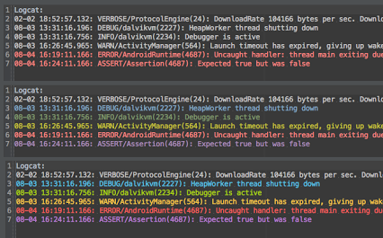

A tip that was passed on to me via Google+ from [+MatoušSkála](https://plus.google.com/u/0/+MatoušSkála)
in this [post](https://plus.google.com/u/0/+Matou%C5%A1Sk%C3%A1la/posts/VJhgiXmTM3f), it is a useful tip to keep around.

Simple adjustments to the colour scheme for Android Studio Logcat that really helps distinguish message levels.

The following colour scheme is based on the Android Studio Darcula theme and is visually shown in the middle example.

To adjust the Logcat Colours, first we make a new custom theme:

- File ->
- Settings ->
- Editor ->
- Colours and Fonts ->
- Android Logcat
- Click "Save As" to save a custom theme.

For each Message type that you would like to change, deselect the "Inherit Attributes From:" checkbox.

- Verbose: Don't Change
- Debug: 6897BB
- Info: 6A8759
- Warning: BBB529
- Error: FF6B68
- Assert: 9876AA

Holo Theme colours (lower of the three examples) can be found [here](https://developer.android.com/design/style/color.html)
but they are a little to bright for my tastes.
